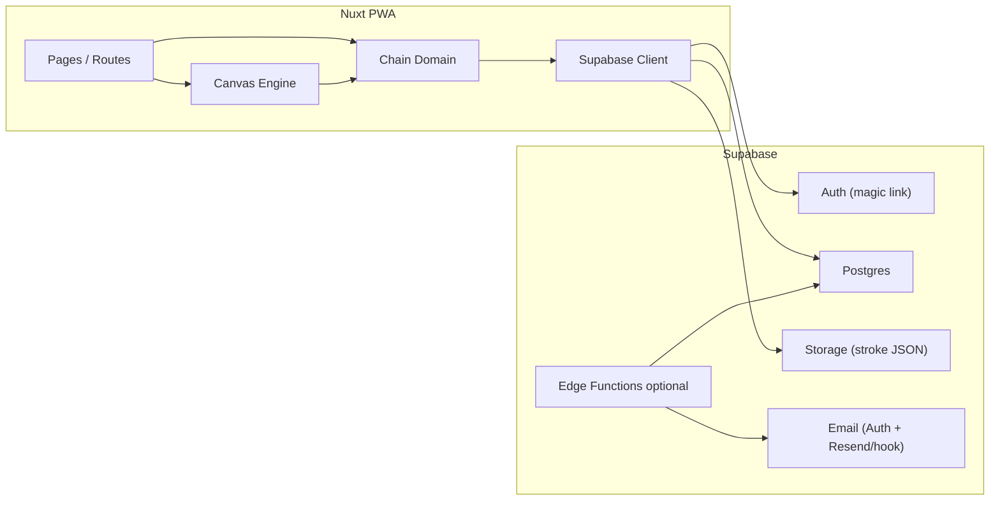
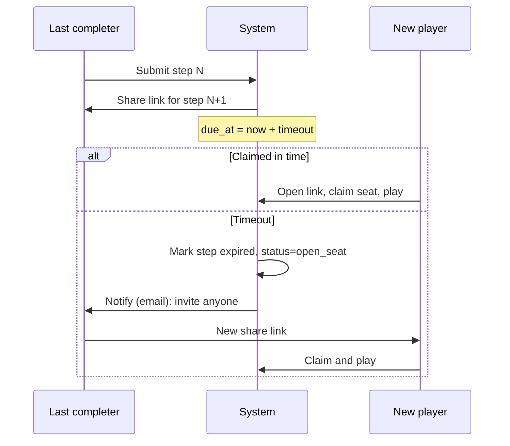

# PenPass — Planned Architecture (V1)

Working title: **PenPass**. Stack: **Nuxt (Vue 3) + Supabase + Tailwind**.  
Friends-first async drawing/guessing chains. This doc is the build blueprint for MVP.

Related: [`base-idea-v3.md`](./base-idea-v3.md) · [`open-questions.md`](./open-questions.md) · [`build-prompt.md`](./build-prompt.md)

---

## 1. Goals & non-goals

| In scope (V1) | Out of scope (V1) |
| --- | --- |
| Create chain, combo prompt, draw/guess loop | Message in a Bottle / community feed |
| Share pass-turn links (Web Share + copy URL) | Polished GIF/MP4 export |
| Timeout → seat frees → last completer re-invites | Paid decks, cosmetics, alt modes |
| Email magic link + nickname; optional “save games” account | SMS |
| Vector stroke JSON + static reveal (+ simple replay if cheap) | Realtime lobby / simultaneous play |
| Mobile-web first (PWA install when easy) | Native apps |

---

## 2. High-level system



**Async model:** players are rarely online together. The app **loads chain state on navigation** and **writes on submit**. No requirement for Realtime in V1. Share links carry the turn.

---

## 3. Runtime views (routes)

| Route | Purpose |
| --- | --- |
| `/` | Landing: start a chain / how it works |
| `/play/new` | Prompt combo (reroll/edit) → first draw → create chain |
| `/c/[chainId]` | Hub: status, share link, or redirect to current action |
| `/c/[chainId]/draw` | Draw step (sees prior guess or initial prompt only) |
| `/c/[chainId]/guess` | Guess step (sees prior drawing only) |
| `/c/[chainId]/reveal` | Full gallery (+ optional time-lapse) when `status = complete` |
| `/c/[chainId]/pass` | After submit: share UI (Web Share / copy link) |
| `/auth/callback` | Supabase magic-link return |
| `/me` | Optional: past games (requires linked account) |

Deep link for invitees: `/c/[chainId]?step=[n]&token=[claimToken]` (or signed invite id) so the open seat is claimable without exposing private history.

---

## 4. Folder structure (Nuxt)

```text
app/
  pages/
    index.vue
    play/new.vue
    c/[chainId]/index.vue
    c/[chainId]/draw.vue
    c/[chainId]/guess.vue
    c/[chainId]/reveal.vue
    c/[chainId]/pass.vue
    auth/callback.vue
    me.vue
  components/
    canvas/
      DrawingCanvas.vue      # input + toolbar
      StrokeRenderer.vue     # paint paths from JSON
      ReplayPlayer.vue       # phase 4
    chain/
      PromptBuilder.vue      # noun+action reroll/edit
      GuessForm.vue
      ShareTurn.vue
      ChainStatus.vue
      RevealGallery.vue
    ui/                      # buttons, layout shells
  composables/
    useChain.ts
    useChainStep.ts
    useDrawingSession.ts
    useAuth.ts
    useShare.ts
  utils/
    prompts/wordBanks.ts
    prompts/generatePrompt.ts
    canvas/strokes.ts        # types, simplify, bounds
    canvas/render.ts
    chain/stateMachine.ts    # next step type, visibility rules
    chain/timeouts.ts
  types/
    chain.ts
    stroke.ts
    database.ts              # generated or hand-synced Supabase types
  assets/css/main.css
public/
  manifest.webmanifest
  icons/
supabase/
  migrations/
  functions/                 # optional: expire steps, send mail
  seed/                      # word banks if DB-backed later
docs/                        # product + this architecture
```

**Layers**

1. **UI** — pages + components  
2. **Canvas engine** — `utils/canvas/*` + canvas components (no Supabase imports)  
3. **Domain** — `utils/chain/*` + composables (`useChain*`)  
4. **Data** — Supabase client in composables / `server/` only where secrets needed  

---

## 5. Domain: chain state machine

### Step sequence (default `max_steps = 6`)

```text
prompt (text, creator only)
  → step 1 DRAW
  → step 2 GUESS
  → step 3 DRAW
  → step 4 GUESS
  → step 5 DRAW
  → step 6 GUESS
  → COMPLETE → reveal
```

Odd steps = draw, even = guess (after the opening prompt).

### Chain statuses

| Status | Meaning |
| --- | --- |
| `active` | Waiting on current open step |
| `awaiting_pass` | Step submitted; holder should share link |
| `open_seat` | Timed out; last completer may invite anyone |
| `complete` | `max_steps` reached; reveal unlocked |
| `abandoned` | Optional hard-stop (future) |

### Visibility rules (critical)

| Viewer context | Can see |
| --- | --- |
| Current **draw** step | Only previous step’s **guess text** (or opening prompt if step 1) |
| Current **guess** step | Only previous step’s **drawing** |
| Before complete | Never full history |
| `reveal` | Full ordered history |

Enforce in **server-trusted queries / RLS**, not only in the UI.

### Timeout & re-invite



**Default timeout:** 24h (configurable constant). V1: creator kick optional; timeout + re-invite is enough.

**Same player twice:** allowed (small friend groups).

---

## 6. Data model (Supabase Postgres)

### Tables (V1)

**`profiles`**
- `id` uuid PK → `auth.users.id`
- `nickname` text
- `email` text
- `created_at`

**`chains`**
- `id` uuid PK (or short public slug)
- `slug` text unique (link-friendly)
- `creator_id` uuid null FK profiles (null until claimed)
- `prompt_text` text
- `max_steps` int default 6
- `status` text
- `current_step` int
- `last_completer_id` uuid null
- `created_at` / `updated_at`

**`steps`**
- `id` uuid PK
- `chain_id` uuid FK
- `step_number` int
- `type` enum: `draw` | `guess`
- `status` enum: `open` | `claimed` | `submitted` | `expired`
- `author_id` uuid null
- `author_nickname` text
- `guess_text` text null
- `stroke_path` text null (Storage path) **or** `stroke_json` jsonb for small payloads
- `claim_token_hash` text null (invite)
- `claimed_at` / `due_at` / `submitted_at`

**`chain_participants`** (for `/me` + finish emails)
- `chain_id`, `profile_id` or email, `nickname`, `role`

### Stroke storage

Prefer **Storage object** per draw step (`strokes/{chainId}/{step}.json`) when payloads are large; keep a DB pointer on `steps`. JSON shape:

```ts
type StrokePoint = { x: number; y: number; t: number } // normalized 0–1 coords
type Stroke = {
  color: string
  width: number
  points: StrokePoint[]
}
type DrawingDocument = {
  version: 1
  aspect: number // width/height
  strokes: Stroke[]
}
```

Normalize coordinates to the canvas logical size so scaling stays crisp across devices.

### Auth & RLS (intent)

- Public can read **only** what the current invite allows (open step payload), not full chain.
- Participants / creator can read more once `complete`.
- Writes: claim step with valid token; submit only if claimed by self; create chain authenticated or anon-then-link email.

Exact policies land in migrations during Phase 2.

---

## 7. Canvas architecture

```text
Pointer events (touch/mouse)
  → useDrawingSession (strokes in memory, undo stack)
  → DrawingCanvas (rAF draw, touch-action: none)
  → export DrawingDocument JSON
  → upload Storage + insert step row

Replay / reveal:
  DrawingDocument → StrokeRenderer / ReplayPlayer (timestamp-based)
```

**Tools (V1):** color presets, size presets, undo, clear, optional eraser (draw background color or stroke flag).

**No** layers, pressure brushes, or PNG-as-source-of-truth.

---

## 8. Prompt generator

Client-side word banks (`utils/prompts/wordBanks.ts`):

- `nouns[]`, `actions[]` (drawable, PG-friendly)
- `generatePrompt()` → e.g. `"a penguin late for work"`
- UI: **Reroll** + **Edit** before first draw

Banks can move to DB later for themed decks; V1 ships static lists.

---

## 9. Notifications

| Event | V1 channel |
| --- | --- |
| Pass turn | **Share link** (primary) |
| Timeout / open seat | Email to last completer |
| Chain complete | Email to participants who left email |
| Magic link | Supabase Auth email |

SMS out. Web Push optional after core loop works.

---

## 10. Security & abuse (V1 baseline)

- Opaque chain slugs + **hashed claim tokens** on open steps  
- RLS so guessers never fetch prior prompts/drawings beyond rules  
- Rate-limit chain creation (Edge or Supabase)  
- Report/skip deferred until Bottle; still avoid logging raw tokens  

---

## 11. Build phases → architecture map

| Phase | Architecture focus |
| --- | --- |
| **1** | `utils/canvas/*`, `DrawingCanvas`, `StrokeRenderer`, local JSON round-trip (no DB required) |
| **2** | Migrations, `stateMachine`, `useChain*`, create/submit step APIs |
| **3** | Routes for claim/play/pass, Web Share, email hooks, auth callback |
| **4** | Reveal gallery, `ReplayPlayer`, finish emails |

---

## 12. Defaults for still-open product questions

| Topic | Architecture default until decided |
| --- | --- |
| Timeout | 24 hours |
| Creator kick | Not in V1 schema beyond `expired` + `open_seat` |
| Same player twice | Allowed |
| Canvas aspect | Square logical canvas (1:1) |
| Stroke storage | Storage file + path on `steps` |

---

## 13. What “done” looks like for V1 architecture

- A friend can start on phone, draw a combo prompt, share a link  
- Invitee only sees the allowed prior step, submits, shares again  
- Ghosted turns expire and return invite power to the last completer  
- At 6 steps, everyone with email gets a finish notice and can open reveal  
- Drawings replay from vectors without depending on PNGs  

When this matches product intent, Phase 1 implementation can start from section 4’s canvas package alone.
